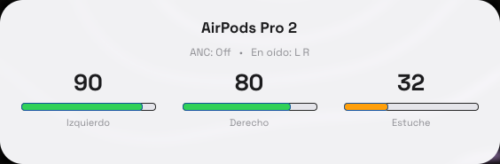

# airpods-helper-linux

Popup estilo Apple + módulo Waybar para ver la batería de AirPods en Linux
(Hyprland/Wayland), usando el daemon [airpods-helper](https://github.com/superninjv/airpods-helper)
por delante.

<div align="center">



</div>

El daemon expone el estado por D-Bus (`org.costa.AirPods`) y estos scripts lo
muestran:

- **`airpods-helper-popup.py`**: tarjeta flotante estilo macOS que aparece al
  conectar los AirPods (o bajo demanda) y se desvanece a los 7 s.
- **`airpods-helper-bar.py`**: módulo para Waybar con porcentajes y clases
  (`high` / `low` / `critical` / `disconnected`).

## Requisitos

- [airpods-helper](https://github.com/superninjv/airpods-helper) instalado y
  funcionando (`airpods-daemon` con D-Bus `org.costa.AirPods`).
- `python-gobject` (pygobject) y `gtk4`.

## Instalación

Copiá ambos scripts a tu `PATH`, por ejemplo:

```bash
install -m 755 airpods-helper-popup.py ~/.local/bin/
install -m 755 airpods-helper-bar.py   ~/.local/bin/
```

### Hyprland

En `~/.config/hypr/hyprland.conf`:

```conf
exec-once = ~/.local/bin/airpods-helper-popup.py
bind = SUPER, A, exec, ~/.local/bin/airpods-helper-popup.py
windowrulev2 = float, title:^(AirPods)$
windowrulev2 = noborder, title:^(AirPods)$
windowrulev2 = noresize, title:^(AirPods)$
windowrulev2 = noinitialfocus, title:^(AirPods)$
windowrulev2 = move 50% 16%, title:^(AirPods)$
```

### Waybar

Ejemplo de módulo (`config.jsonc`):

```jsonc
"custom/airpods": {
    "exec": "~/.local/bin/airpods-helper-bar.py --json",
    "return-type": "json",
    "interval": 5,
    "tooltip": true,
    "format": "{}"
}
```

Clases CSS disponibles: `high`, `low`, `critical`, `disconnected`.

## Uso

```bash
airpods-helper-bar.py           # texto plano:  L 100%  R 90%  C 47%
airpods-helper-bar.py --json    # para waybar (return-type: json)
airpods-helper-popup.py         # inicia/activa el popup (instancia única)
```

El popup usa `Gio.Application` con `application_id = org.costa.AirPodsPopup`:
si ya hay una instancia corriendo, invocarlo de nuevo simplemente la reactiva
(ideal para el binding de teclado). Se autooculta a los 7 s y solo se mantiene
visible si la batería cambia.

## Config de airpods-helper

Si los AirPods entran y salen repetidamente cuando están en el estuche,
desactivá el auto-reconnect en `~/.config/airpods-helper/config.toml`:

```toml
auto_reconnect = false
```

## Troubleshooting

- **Conectar con `br-connection-key-missing`**: re-pareá los AirPods y confirmá
  con `bluetoothctl` el trust del dispositivo.
- **No aparece el popup**: asegurate de que el daemon esté activo
  (`systemctl --user status airpods-daemon`) y de haber aplicado las reglas
  `float` / `noborder` de Hyprland.